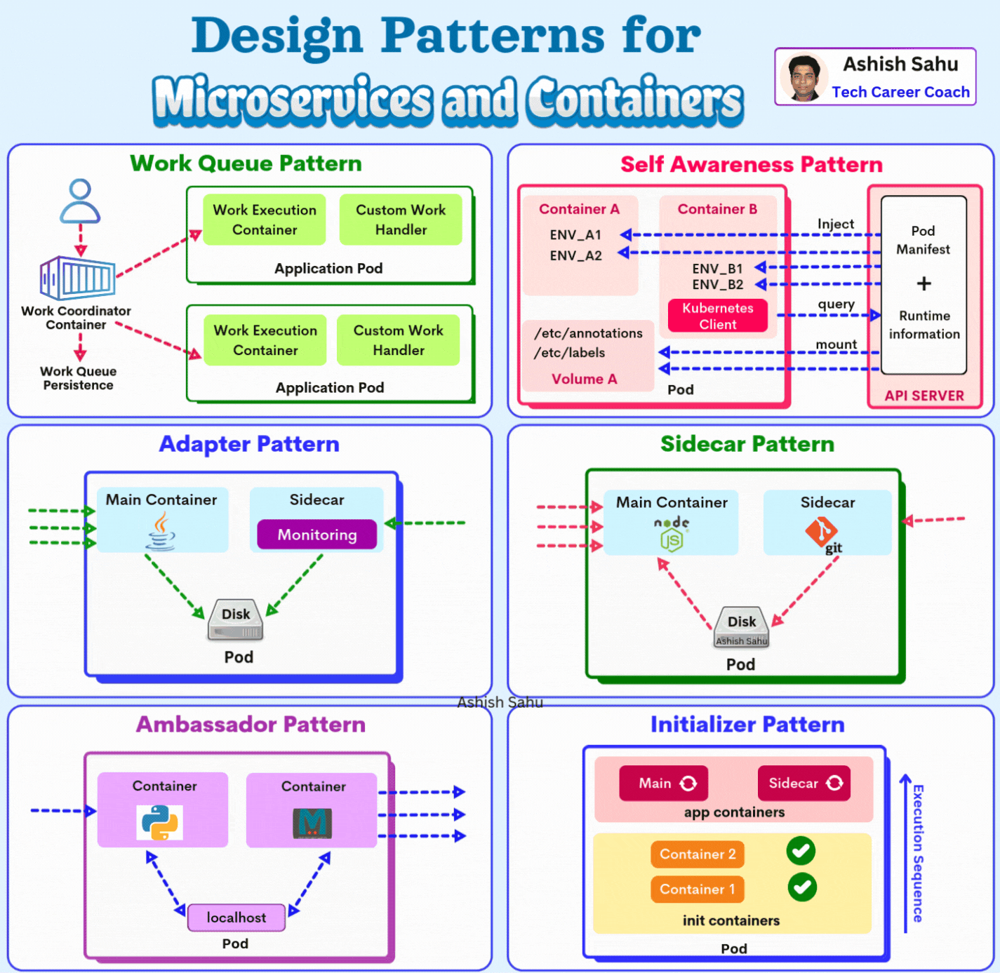
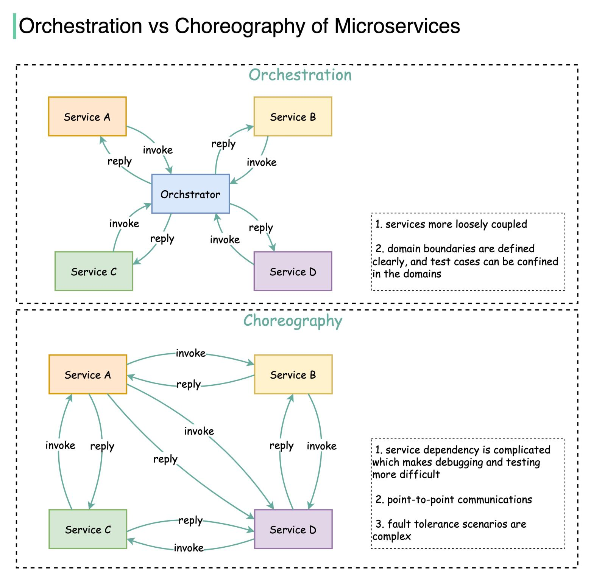

### 𝐃𝐞𝐬𝐢𝐠𝐧 𝐏𝐚𝐭𝐭𝐞𝐫𝐧𝐬 𝐟𝐨𝐫 𝐌𝐢𝐜𝐫𝐨𝐬𝐞𝐫𝐯𝐢𝐜𝐞𝐬 𝐚𝐧𝐝 𝐂𝐨𝐧𝐭𝐚𝐢𝐧𝐞𝐫𝐬

Microservices architecture has become a popular approach for building scalable, maintainable, and efficient applications. These patterns enhance the overall infrastructure by ensuring smoother operation and optimized use of containers.

𝐒𝐢𝐝𝐞𝐜𝐚𝐫 𝐏𝐚𝐭𝐭𝐞𝐫𝐧: It is a supplementary container running in parallel to the main service within the same pod (in Kubernetes) or environment.

𝐀𝐝𝐚𝐩𝐭𝐞𝐫 𝐏𝐚𝐭𝐭𝐞𝐫𝐧: It acts as a bridge between two services that need to interact but use different communication protocols or formats.

𝐒𝐞𝐥𝐟-𝐀𝐰𝐚𝐫𝐞𝐧𝐞𝐬𝐬 𝐏𝐚𝐭𝐭𝐞𝐫𝐧:  Microservices are designed with introspection capabilities, allowing them to adjust behavior dynamically based on resource availability, workload, or system state.

𝐀𝐦𝐛𝐚𝐬𝐬𝐚𝐝𝐨𝐫 𝐏𝐚𝐭𝐭𝐞𝐫𝐧:  A service proxy that manages networking responsibilities, including API calls, routing, authentication, and logging on behalf of the microservice.

𝐈𝐧𝐢𝐭𝐢𝐚𝐥𝐢𝐳𝐞𝐫 𝐏𝐚𝐭𝐭𝐞𝐫𝐧: A pattern in which a component performs initialization tasks such as setting up configurations, seeding databases, or fetching required data before the microservice starts.

𝐖𝐨𝐫𝐤 𝐐𝐮𝐞𝐮𝐞 𝐏𝐚𝐭𝐭𝐞𝐫𝐧: A pattern where incoming tasks or workloads are added to a queue, and worker services consume and process the tasks

### How do microservices collaborate and interact with each other?
* There are two ways: 𝐨𝐫𝐜𝐡𝐞𝐬𝐭𝐫𝐚𝐭𝐢𝐨𝐧 and 𝐜𝐡𝐨𝐫𝐞𝐨𝐠𝐫𝐚𝐩𝐡𝐲.
1. Orchestration:
    - Centralized Control: A central orchestrator manages workflows by calling services.
    - Loosely Coupled Services: Services don't communicate with each other, only with the orchestrator.
    - Pros: Easier to debug, clear boundaries, structured processes.
    - Cons: Orchestrator can become a bottleneck or single point of failure.

2. Choreography:
    - Decentralized Communication: Services interact directly through events or messages.
    - Point-to-Point Dependencies: Each service manages its interactions.
    - Pros: Highly scalable, flexible for event-driven systems.
    - Cons: Harder to debug, complex fault handling, difficult to manage dependencies.

* When to Use:
    - Orchestration: For structured workflows (e.g., order processing).
    - Choreography: For reactive systems (e.g., event-driven e-commerce).

Hybrid Approach: Many systems use both—high-level orchestration with low-level choreography for flexibility.
