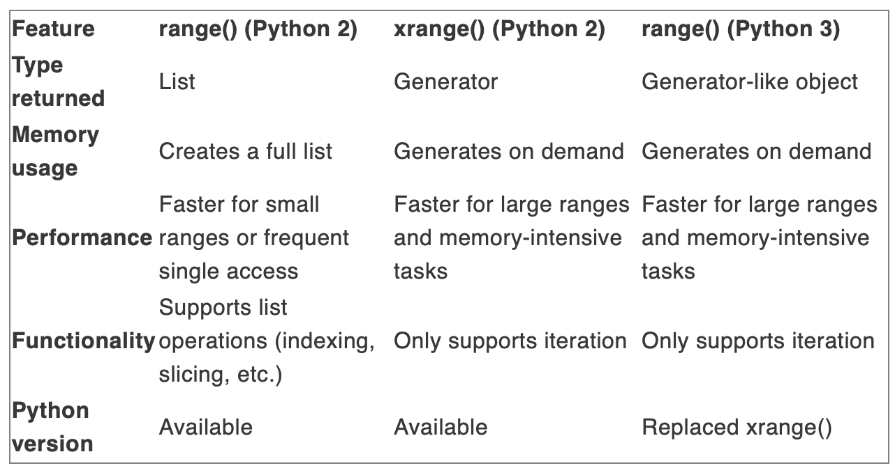

### Why is Python called interpreted Language?
- Executes instructions directly and line by line
- Does not compile and run a complete program at once
- When it encounters an errors, it stops
- This makes Python easier to debug
- Python doesn't need a separate compilation step.

### What are the built-in data types in Python?
* Text Type: str
* Numeric Types: int, float, complex numbers
* Sequence Types: list, tuple, range
* Map Type: dictionary
* Set Type: set, frozenset
* Boolean Type: bool
* Binary types: bytes, bytearray, memoryview
* NoneType: NoneType

### how Python Lists are capable of doing things like Dynamic sizing and storing Heterogeneous Elements?
* The secret is, when we create a list, it actually holds references (pointers) to objects rather than the raw data in a dynamic array.
* These objects can be of any data type, so size would not be an issue.
* The Underlying data structure for Python lists is dynamic array. The idea used is similar to implementation of vectors in C++ or ArrayList in Java.
* A dynamic array is an array-like data structure with automatic resizing. The underlying array is dynamically resized as elements are added or removed, allowing the list to efficiently grow or shrink as needed.
* [Details](https://medium.com/@AbhiramiVS/python-lists-a-comprehensive-guide-to-implementation-and-alternatives-b2b4ce99374e)

### What are the differences between list and tuple and set?
* Tuples are immutable objects, lists are mutable
* Once defined, tuples have a fixed length and lists have a dynamic length
* Tuples uses less memory and are faster to access than to lists
* Sets are mutable, but unordered collection and has no duplicate elements
* Items in set cannot be changed or replaced but you can remove and add new items.

### Difference between dictionary and JSON?
* JSON keys can only be strings whereas dictionary keys can be hashable objects
* Keys are ordered sequentially and can be repeated in JSON, but in dictionary keys can not be repeated and must be distinct

### What is the differences between modules and packages?
* A module in Python is simply a .py file containing Python code
* Package is a collection of modules

### Explain the use of lambda expressions in Python. When is it useful?
* lamda is basically a function without a name
* useful in situations where you need a small temporary function and where you need to pass a function as a parameter
```
// a regular function
def add(x,y)
    return(x+y)

// a lambda function
add2 = lambda x,y: x+y
```

### Explain slicing in Python
* Slicing allows you to access a subset or a "slice" of a list
* Slice specifies a start index and an end index of a list

### What is shallow copy and deep copy in Python.
* Shallow copy stores the reference of the original elements where deep copy creates new objects which contains all the data of original elements

### What is inheritance in Python, explain single inheritance and multiple inheritance.

### What is decorators?
* Decorators are a special kind of function that add extra functionality to another function

### Explain the difference between "is" and "=="?
* "==" checks only values are equal or not where "is" operator checks reference with values

### What is PEP 8?
* PEP 8 is the style guide for writing Python code
* It provides guidelines and best practices for formatting Python code to ensure readability and consistency across python projects

### What is the difference between / and // in python?
* // defines floor division where single slash defines precise division
```
5//2 = 2
5/2  = 2.5
```

### What are *args((Non-Keyword Arguments)) and *kwargs(Keyword Arguments)?
* *args accepts all the parameters passed to the function and computes the function operations for each of them.
* Keyword arguments are like a dictionary, which maps the value to its associated key
```
# Program to add and display the sum of n number of integer
def add(*num):
    sum = 0;
    for n in num:
        sum = sum + n;
    print("Sum:", sum)

add(2,6)
add(3,4,5,6,7)
add(1,2,3,5,6,7,8)
```

```
# Print values of function Person along with its associated keywords
def Person(**kwargs):
    for key, value in kwargs.items():
        print("{} -> {}".format(key, value))    # OR print(f'{key} -> {value}')
Person(Name = 'Sean', Sex = 'Male', Age = 38, City = 'London', Mobile = 9375821987)
```

### What is the difference between xrange and range functions?
* range() generates a list
* it consumes more memory, especially when dealing with a large sequence of numbers
* xrange() generates numbers on demand, making it a more memory-friendly option
* 