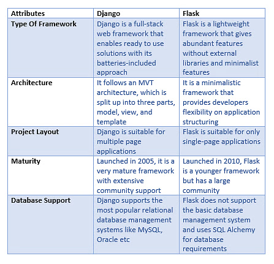
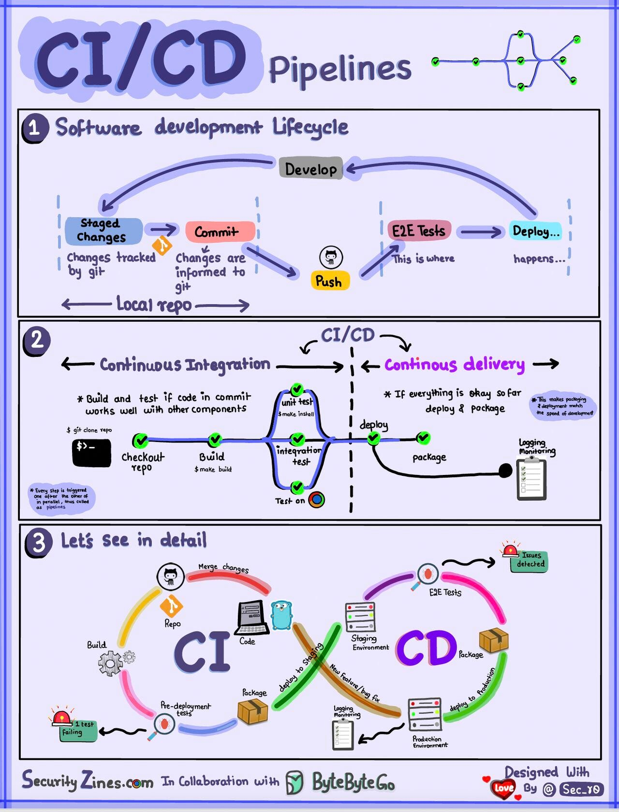
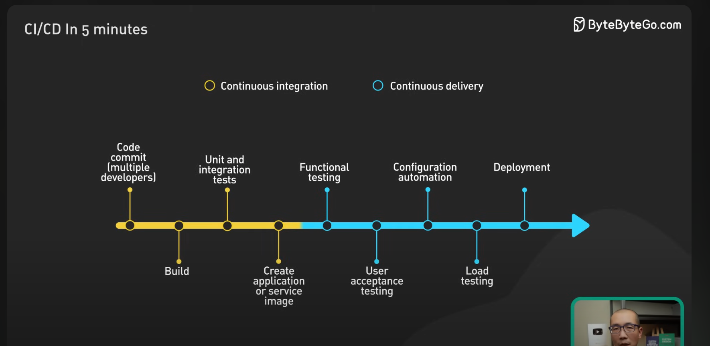
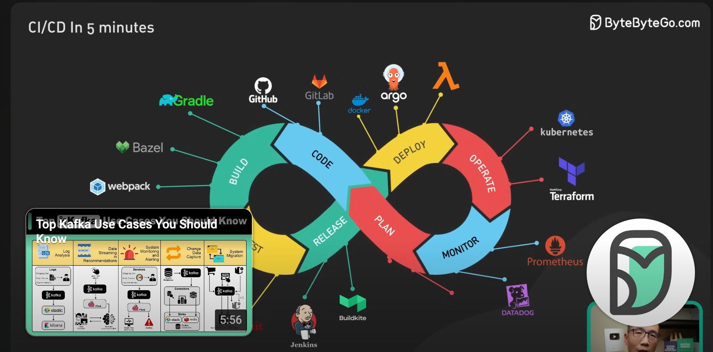

> Python Fundamentals
### Explain the Global Interpreter Lock (GIL) in Python and its impact on multi-threaded applications?
* GIL, in simple words, is a mutex (or a lock) that allows only one thread to hold the control of the Python interpreter.
* A Mutex is a Mutually exclusive flag. It acts as a gate keeper to a section of code allowing one thread in and blocking access to all others.
* This means that only one thread can be in a state of execution at any point in time. The impact of the GIL isn’t visible to developers who execute single-threaded programs, but it can be a performance bottleneck in CPU-bound and multi-threaded code.
* [Details](https://realpython.com/python-gil/)

### How do you manage memory efficiently in Python, especially with large datasets?
1. Use Generators & Iterators 
   - They allow you to iterate over data without loading the entire dataset into memory. 
   - By using generator expressions or functions with the yield statement, you create a sequence of data that is generated on-the-fly and consumed one item at a time, significantly reducing memory usage.
2. Optimize Data Types
   - Python's standard data types are not always the most efficient in terms of memory usage. For example, using int for large numbers consumes more memory than necessary. You can use alternative data types like float or decimal when appropriate, or libraries like NumPy that offer more memory-efficient array types.
3. Process in Chunks
   - Instead of loading the entire dataset into memory, you break it into manageable pieces and process each chunk sequentially. 
   - This approach is particularly effective when you can't use generators because the data processing requires random access or the dataset is too large to fit into memory even as a generator.
4. Use Memory Profilers
   - By using a memory profiler, you can pinpoint where most of the memory is being used and optimize those sections.
   - Python provides several memory profiling packages that can give you detailed reports on your program's memory consumption, allowing you to make informed decisions about where to focus your optimization efforts.
5. Employ Garbage Collection
   - Garbage collection (GC) in Python helps free up memory by removing objects that are no longer in use.
   - You can manually trigger garbage collection or tweak its parameters to better suit your application's needs. For instance, disabling GC temporarily during a critical memory-intensive operation can sometimes improve performance, but be sure to re-enable it afterward to prevent memory leaks.
6. Utilize External Storage
   - When working with datasets larger than available memory, consider utilizing external storage solutions like databases or file systems.
   - Storing data externally and querying only the necessary parts into memory can significantly reduce your program's memory footprint. Python's various I/O libraries allow you to read and write data to files and databases efficiently, enabling you to handle datasets that would otherwise be too large to process in-memory.

### Describe Python's garbage collection mechanism and its significance in memory management.
* When previously allocated memory no longer serves a purpose in your system, Python programs implement a process known as garbage collection.
* Garbage collection is an automatic process that detects memory the system isn’t using and frees up that space.
* This allows you to avoid any problems with forgetting to deallocate memory. Although garbage collection is an automatic process, you do have the ability to make some modifications. For example, you can customize the time intervals in which the deallocation of memory activates.

### What are the differences between Python 2 and Python 3 and how do you handle code migration?

### Explain the concept of generators in Python and their advantages
* A Python generator function allows you to declare a function that behaves like an iterator, providing a faster and easier way to create iterators.
* They can be used on an abstract container of data to turn it into an iterable object like lists, dictionaries and strings.
* [Details](https://builtin.com/software-engineering-perspectives/python-generators#:~:text=What%20Is%20a%20Python%20Generator,like%20lists%2C%20dictionaries%20and%20strings.)

> Object Oriented Programming
### Describe the principles of OOD and how they apply to Python

### What is multiple inheritance in Python?
* Types of Inheritance
   - Single Inheritance: Single-level inheritance enables a derived class to inherit characteristics from a single-parent class.
   - Multilevel Inheritance: Multi-level inheritance enables a derived class to inherit properties from an immediate parent class which in turn inherits properties from his parent class. 
   - Hierarchical Inheritance: Hierarchical-level inheritance enables more than one derived class to inherit properties from a parent class.
   - Multiple Inheritance: Multiple-level inheritance enables one derived class to inherit properties from more than one base class.

### Explain the purpose of magic methods (__init__, __str__) in Python classes.
* A method that is called implicitly by Python to execute a certain operation on a type, such as addition. Such methods have names starting and ending with double underscores.
* [Details](https://realpython.com/python-magic-methods/)
### How do you achieve encapsulation, inheritance and polymorphism in Python

> Python libraries and frameworks
### Describe the key differences between Django and Flask and when would you choose one over the other for web development
* 

### How do you work with asynchronous programming in Python and what libraries or framework have you used for this purpose
`import asyncio
async def main():
    print('Hello ...')
    await asyncio.sleep(1)
    print('... World!')
asyncio.run(main())`
* Asynchronous programming is a paradigm that enables a program to execute multiple tasks concurrently without waiting for each task to complete before starting the next one.
* This technique leverages the asyncio module in Python to manage asynchronous tasks efficiently. 
* When you mark a function as async, it becomes a coroutine, indicating that it can be paused and resumed during its execution. You can use await to call other coroutines and efficiently manage concurrent operations within a coroutine.
* The await keyword is used to signify that the coroutine should pause execution until the awaited task completes. During this pause, the event loop can switch to executing other tasks efficiently using system resources. Once the awaited task is complete, the coroutine resumes from where it left off.

### What is the gunicorn server and how does it relate to Python web applications?
* [Details](https://devcenter.heroku.com/articles/python-gunicorn#:~:text=Gunicorn%20is%20a%20pure%2DPython,%2C%20flexibility%2C%20and%20configuration%20simplicity.)
* Gunicorn is a pure-Python HTTP server for WSGI applications. It allows you to run any Python application concurrently by running multiple Python processes within a single dyno. It provides a perfect balance of performance, flexibility, and configuration simplicity.
* The Django and Flask web frameworks feature convenient built-in web servers, but these blocking servers only process a single request at a time. If you deploy with one of these servers on Heroku, your dyno resources will be underutilized and your application will feel unresponsive.
> Databases and SQL
### Discuss the advantages and disadvantages of using SQL databases like SQL server and PostgresSQL with Python

### How do you optimize database queries for performance in a Python application
* Choose the right database engine
* Use ORM tools
* Cache data
* Index tables
* Write efficient queries
* [Read details, it's Important](https://www.linkedin.com/advice/1/how-can-you-optimize-database-performance-python-mhxef)

### Describe your experience with data modeling and schema design in Python
* Data modeling is designing a visual representation of a system’s data. This model serves as a blueprint for creating a database or data structure that accurately reflects the relationships and constraints of the data it stores.
* Types of Data Models
  - Conceptual Data Model
  - Logical Data Model
  - Physical Data Model

### What are the differences between SQLAlchemy and django ORM for database interactions in Python
* [Read](https://www.geeksforgeeks.org/django-orm-vs-sqlalchemy/)

> Web Development
### Walk through the process of creating a RESTful API using Flask, including handling authentication and authorization
* Register views @blueprint.before_app_first_request
* Remember blueprint for routing
* @jwt_required for jwt validation

### Explain how session management is handled  Python web applications

### Describe best practices for securing Python web applications against common vulnerabilities
* Validate inputs and sanitize data
* Use secure coding libraries and tools
* Keep Python and libraries up-to-date
* Implement error handling and logging wisely
* Adhere to the principle of least privilege
* Use HTTPS for data transmission
* Conduct regular security audits and reviews

> DevOps and Cloud Technologies:
### How do you containerize Python applications and what tools have you used for this purpose(e.g. Docker)
* Create a Python application
* Create a Dockerfile
* Build the Docker image
* Run the Docker container
### Describe your experience with deploying Python applications on cloud platforms like AWS, Docker, Kubernetes or ECS
### Explain the concepts of continuous integration and continuous delivery and how they are implemented in a Python development environment
* 
* 
* 

> Testing and Debugging
### Describe the types of testing including unit testing, integration testing, end-to-end testing
### How do you profile and optimize Python code for better performance?
### Explain your approach to debugging complex Python applications, especially in production environments

> Scalability and Performance
### What strategies do you use to optimize the performance of Python applications especially when dealing with a high volume of requests?
### Describe your experience with load balancing and scaling Python applications horizontally
### How do you handle data consistency and synchronization in distributed systems

