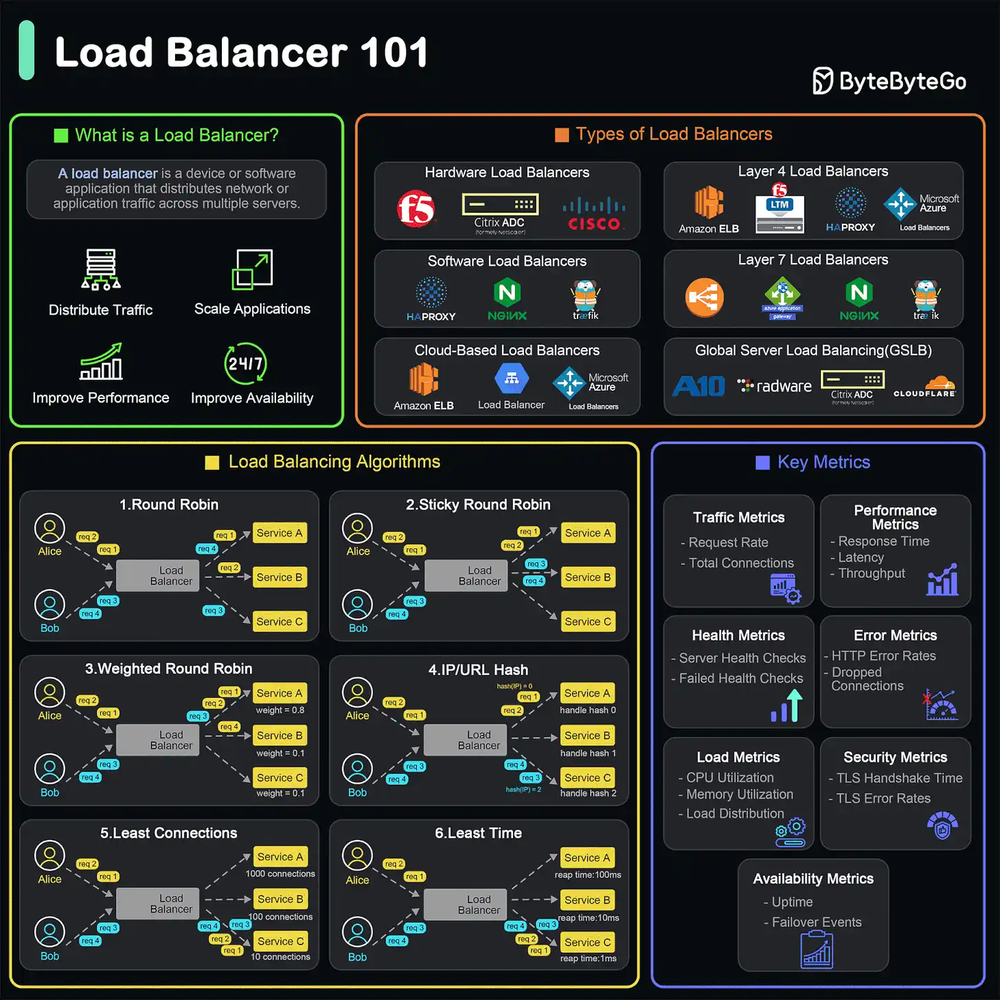

### What is a Load Balancer?
- A load balancer is a device or software application that distributes network or application traffic across multiple servers. 
- 
### What Does a Load Balancer Do?
  1. Distributes Traffic
  2. Ensures Availability and Reliability
  3. Improves Performance
  4. Scales Applications

### Types of Load Balancers
  1. Hardware Load Balancers: These are physical devices designed to distribute traffic across servers.
  2. Software Load Balancers: These are applications that can be installed on standard hardware or virtual machines.
  3. Cloud-based Load Balancers: Provided by cloud service providers, these load balancers are integrated into the cloud infrastructure. Examples include AWS Elastic Load Balancer, Google Cloud Load Balancing, and Azure Load Balancer.
  4. Layer 4 Load Balancers (Transport Layer): Operate at the transport layer (OSI Layer 4) and make forwarding decisions based on IP address and TCP/UDP ports.
  5. Layer 7 Load Balancers (Application Layer): Operate at the application layer (OSI Layer 7) .
  6. Global Server Load Balancing (GSLB): Distributes traffic across multiple geographical locations to improve redundancy and performance on a global scale.