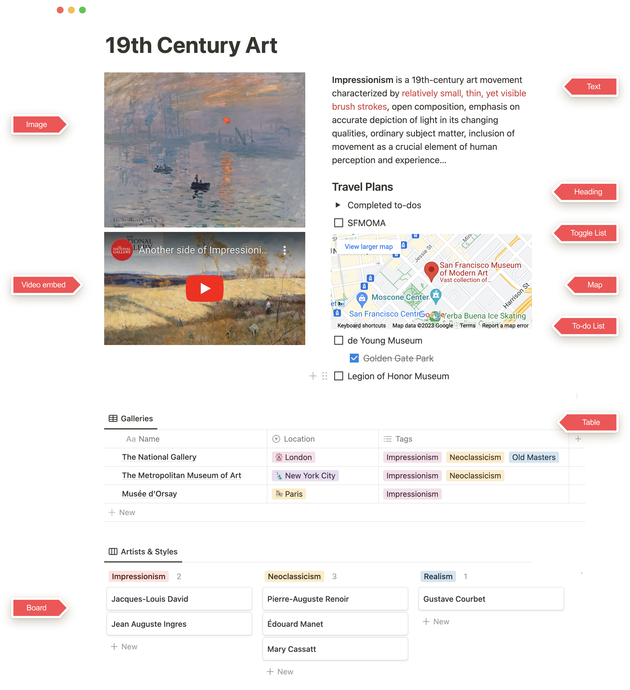
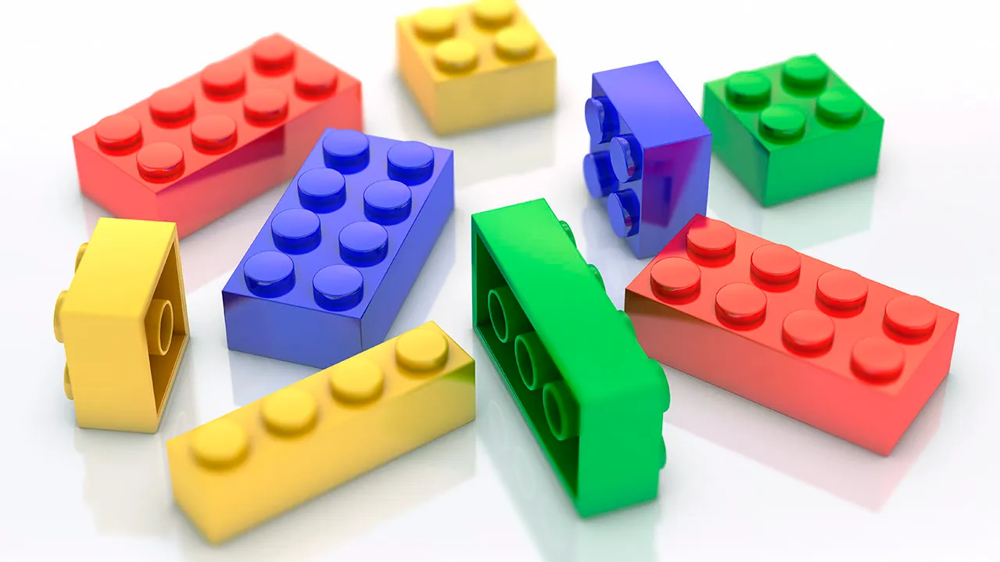

### Resource links
[data-model-behind-notion](https://www.notion.com/blog/data-model-behind-notion)
* Everything you see in Notion is a block.
* Text, images, lists, a row in a database, even pages themselves — these are all blocks, dynamic units of information that can be transformed into other block types or moved freely within Notion.


### What is a block?
- When you create your first page in Notion and begin typing, you've started with a text block. But Notion pages can contain a lot more than plain text!
- Imagine every piece of content you add to a page — whether it's text, an image, or a table — as a single building block.
- Every page is a stack of blocks combined however you want.
- 


### What is LEGO and why notion uses LEGO structure
- EGOs are plastic building-block toys that rose to massive popularity in the mid-20th century
- 
### Why notion is loved by users?
- [Ivan Zhao](https://medium.com/dnx-ventures/why-notion-is-loved-by-users-customization-and-quality-f4bde5e38663)
- It’s something you can think of as a combination of notes, documents, wiki, project management, all in one product. For many teams and companies, Notion can be the collaboration tool to replace email, Slack, Google Docs, Asana, Trello, Evernote
- It’s extremely flexible. You can almost mold it into any types of tool you want for yourself. We call it a Lego for software.
- Minimal UI to enable users to focus on contents
```
“We’d rather do fewer things and do them really,
really well and put a lot of love and attention to detail
into the product.”
 ```